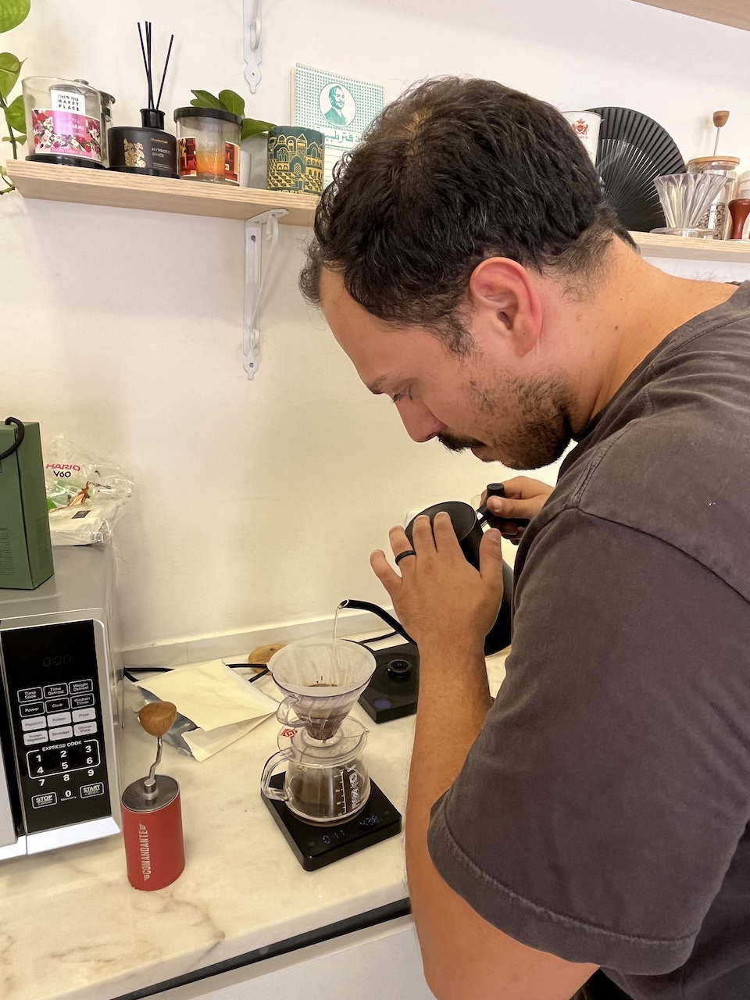
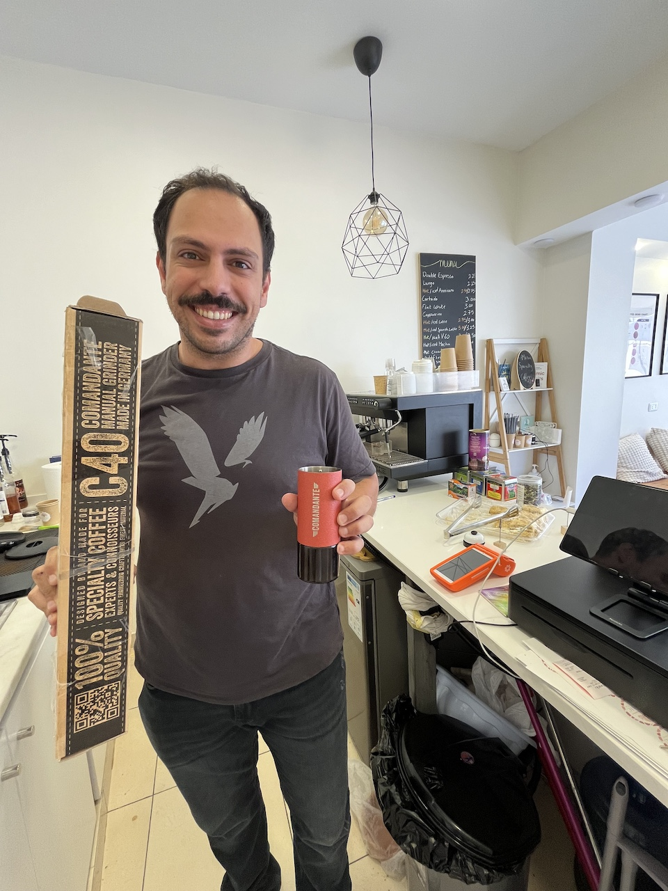
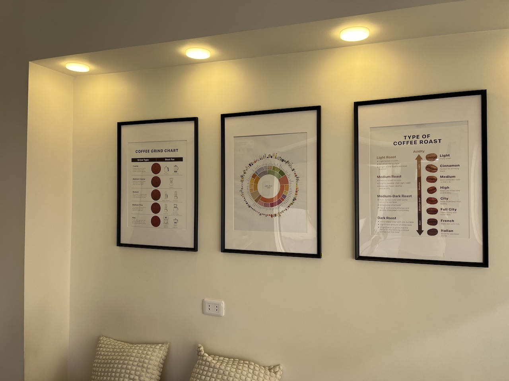
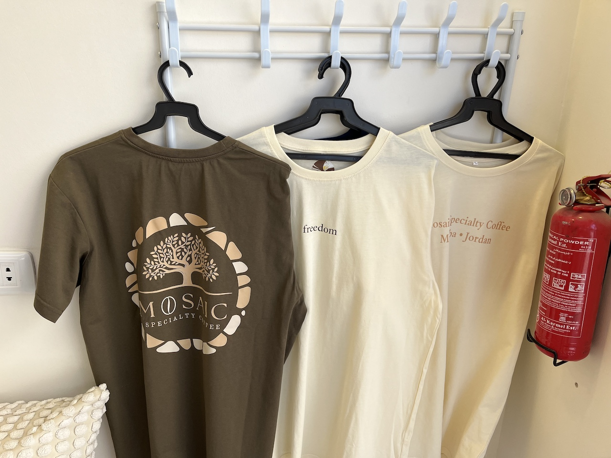
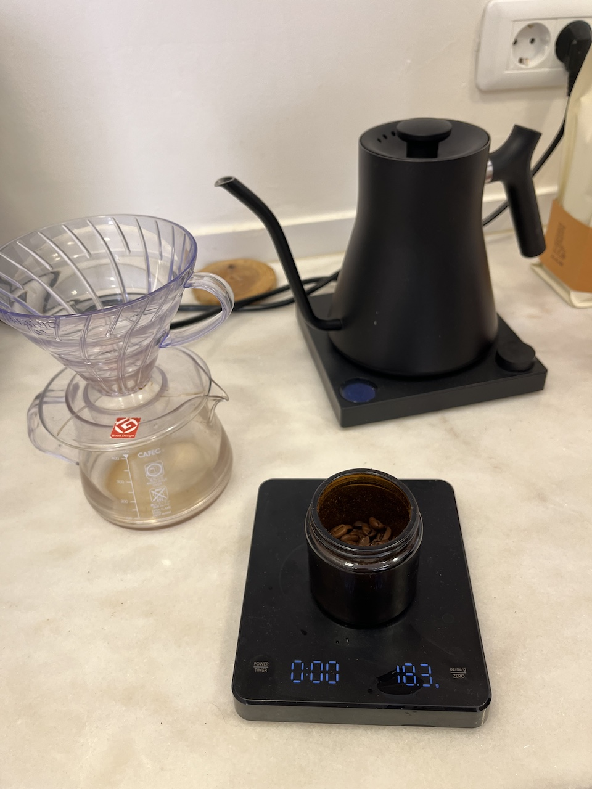

Pour découvrir plus de bonnes adresses où acheter ou déguster un café de qualité en Belgique ou ailleurs :

- **Coffee Insurrection :** [https://www.coffeeinsurrection.com/the-best-specialty-coffee-in-europe.html](https://www.coffeeinsurrection.com/)
- **European Coffee Trip :** [https://europeancoffeetrip.com/](https://europeancoffeetrip.com/)

En voyage ? Jetez un oeil sur le classement des 100 meilleurs coffee shops : [https://theworlds100bestcoffeeshops.com/](https://theworlds100bestcoffeeshops.com/)

## 🇧🇪 Belgique


Laboratoire ouvert et torréfacteur de quartier à Ixelles, où Xavier Beressy et son équipe torréfient sur place des cafés de spécialité soigneusement sourcés. Ambiance simple et conviviale, filtres remarquables et ateliers barista pour les curieux. Champion de Belgique Aeropress 2024.



Coffee shop cosy au bord du Marché aux Poissons (Vismet), connu pour sa carte créative : espressos classiques, cold brew, et lattes originales (bleuet, betterave, ube, sésame noir…). Petite sélection de pâtisseries, options véganes.



Micro-torréfacteur belge au sud de Bruxelles, fondé par Tanguy en 2020. Cafés saisonniers, traçables et éthiques, torréfiés pour révéler clarté et caractère de chaque origine — sans les standardiser. Vente en ligne et abonnements depuis la roasterie.



Petit coffee shop chaleureux près de la Grand-Place de Mons, tenu par Ludovic Pirrera : barista globe-trotter qui torréfie lui-même ses grains dans son atelier de Ghlin. Espresso corsé, V60 et Aeropress, grains en vente et ateliers cupping. Grains sourcés auprès de coopératives traceables.



Torréfacteur pionnier du café de spécialité en Belgique, fondé à Louvain en 2012 par Jens Crabbé, double champion belge Cup Tasters. L'adresse bruxelloise du Dansaert — installée dans une ancienne galerie d'art — combine torréfaction, bar ouvert, deux espressos et quatre filtres en rotation. Classé 67e au palmarès [The World's 100 Best Coffee Shops](https://theworlds100bestcoffeeshops.com/locales/mok-coffee/).

*Autres adresses : Diestsestraat 165, 3000 Louvain · Rue Saint-Laurent 36, 1000 Bruxelles (MOK Studio).*



Café de spécialité né d'une envie simple : un espace de qualité et accessible à Woluwe-Saint-Lambert. Grains sélectionnés avec soin, torréfacteurs partenaires, traçabilité complète et accueil sans chichi — petits producteurs, espresso et filtres dans une ambiance chaleureuse.



Torréfacteur contemporain bruxellois qui source, torréfie et sert des cafés d'exception. Flagship au centre-ville (Sainte-Catherine), avec aussi Flagey (Lesbroussart) et Dansaert (rue de Flandre). Série « Released on 12 », abonnements et vente wholesale.


## 🇫🇷 France


Institution lilloise depuis 2013 : espresso bar, salon de thé et torréfacteur artisanal certifié bio (Ludovic Fiers). Petits-déjeuners, brunchs du samedi, pâtisseries maison, matcha et chocolats chauds dans un coffee shop cosy du centre-ville.



Torréfacteur de café de spécialité parisien ouvert depuis septembre 2023, niché dans le 9e arrondissement. Liperli sélectionne exclusivement des cafés scorés au-dessus de 84 SCA, torréfiés sur place, et propose régulièrement des micro-lots et nano-lots éphémères impossibles à reproduire. Machine Kees van der Westen pour des espressos précis, extractions douces (V60) et boissons créatives. Ambiance chaleureuse, sélection musicale soignée et pâtisseries artisanales — un vrai coup de cœur.


## 🇨🇦 Canada


Pause-café de qualité dans le Vieux-Montréal, à deux pas du Square-Victoria. Torréfacteurs canadiens en rotation (dont Bows & Arrows), ambiance conviviale et pâtisseries de Hof Kelsten et Godley & Creme. Le nom est un clin d'œil philosophique — avec un « A », pas un « E ».



Petit torréfacteur indépendant d'Ottawa, co-fondé par un roaster et un barista, avec trois cafés et une activité wholesale. Culture café soignée, hospitalité chaleureuse et engagement pour élever la scène canadienne. Classé 71e au palmarès [The World's 100 Best Coffee Shops](https://theworlds100bestcoffeeshops.com/locales/little-victories-coffee/).


## 🇰🇷 Corée du Sud


À deux pas de la station Anguk et du palais de Changdeokgung, tonti se cache dans les ruelles paisibles au pied du village traditionnel de Bukchon. Café filtre crémeux, Dubancho et Banko Gotti d'Éthiopie, cookies moelleux — une adresse abordable et photogénique entre hanok et ruelles en pente.



Adresse coup de cœur pour l'ambiance et la vue — mais soyons clairs : c'est plutôt un salon de thé traditionnel qu'un café de spécialité. Cha.ddeul est l'une des adresses les plus paisibles de Bukchon, installée dans une hanok au détour des ruelles en pente. Cour intérieure silencieuse, thés coréens, desserts délicats et café filtre dans un cadre préservé, presque méditatif.

Entre une visite du palais de Changdeokgung et une promenade dans Bukchon Hanok Village, l'endroit idéal pour ralentir après l'agitation de Séoul — surtout en automne, lorsque les feuilles tombent dans le jardin.


## 🇯🇴 Jordanie


Quelle belle surprise de découvrir Mosaic Specialty Coffee au détour d'une rue de Madaba ! Déco cosy et moderne, ce charmant endroit a ouvert début 2024 par le barista Iskandar et son épouse. Nous avons été accueillis chaleureusement et avons pu déguster un café filtre préparé dans les règles de l'art. Le reste de la famille a opté pour des thés glacés et une pâtisserie maison. Je recommande vivement de vous y arrêter avant ou après la visite de l'église Saint-Jean-Baptiste.

<!-- gallery -->

  
  
  
  
  


