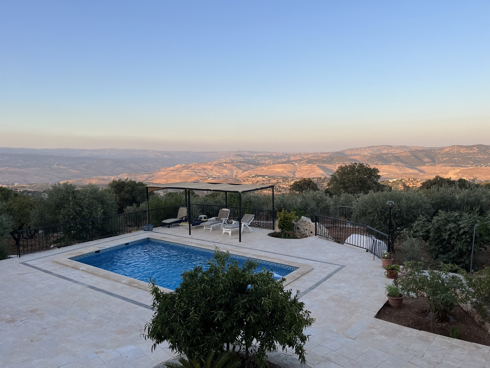

On nous a dit tant de bien sur la Jordanie que nous avons décidé d'aller visiter ce magnifique pays. Au programme : randonnées dans les **wadi** (vallées et lits de rivière asséchés qui ne reprennent vie qu'après les pluies — le mot revient partout, de Wadi Rum à Wadi Musa), sites historiques, nuit dans le désert, plongée et snorkelling… Pour préparer les randonnées, nous avions consulté le blog [Family in Jordan](https://familyinjordan.com/) et emporté le bouquin **60 idées pour découvrir autrement la Jordanie**.

## Jour 1: Arrivée en Jordanie

- Vol depuis Bruxelles-Charleroi à 6h30
- Arrivée prévue 12h20, finalement 12h. Retard au décollage, temps de vol 4h. Malaise d'un passager.
- Change de l'argent près d'Europcar. Premier comptoir de change avant les Jordan Pass à éviter.
- Voiture Europcar Geely noire automatique.
- Arrêt courses boulevard à Amman + boulangerie.
- Arrivée à la **[Zai Zaman Villa](https://www.instagram.com/zaizamanvilla)** (Nord d'Amman / As-Salt) — villa rustique entre oliviers et amandiers, avec piscine et vue dégagée sur la campagne.
- Restaurant FAI avec service valet.
- Premières **lemon'nana** — citronnade à la menthe (mot-valise arabe *limon* + *nana*), servie bien fraîche et devenue notre boisson d'appoint tout au long du séjour.
- Kofta au tahini (viande hachée épicée nappée d'une sauce sésame-citron), kofta aux tomates, sambousek (feuilletés frits farcis à la viande), hoummous et hoummous au pesto, tabouleh et grillades mixtes — premier contact réussi avec la cuisine levantine.

## Jour 2: Umm Qais

- **Umm Qais** au matin – 1h50 de route depuis la villa
- Problème de GPS indiquant Le Caire ou aéroport de Beyrouth (guerre Israël-Palestine).
- Guide à l'entrée propose ses services (15 JOD → 35 JOD au final).
- Visite de **Gadara**, cité gréco-romaine membre de la Décapole et inscrite sur la liste indicative de l'UNESCO — théâtre en basalte noir, temple, nymphées, boutiques le long de la voie romaine et village ottoman construit avec les pierres antiques du site.
- Vue sur le lac de Tibériade et la vallée du Yarmouk ; points de vue sur la Syrie depuis le promontoire (~380 m d'altitude).
- Verre au Resthouse avec superbe vue.


  
  
  
  

- Piscine à la Zai Zaman Villa.

## Jour 3: Jerash & Aljoun

- **Jerash** au matin — l'antique **Gerasa**, deuxième site le plus visité de Jordanie après Pétra, et l'une des cités gréco-romaines les mieux conservées hors d'Italie. Membre de la **Décapole** (ligue de dix cités semi-autonomes sous protection romaine), elle a prospéré grâce aux routes commerciales qui reliaient la Méditerranée à l'Arabie et aux échanges avec les Nabatéens de Pétra. Au sommet de sa splendeur au IIe siècle, la ville comptait jusqu'à 20 000 habitants.
- On entre par l'**arc d'Hadrien**, érigé en 129 apr. J.-C. pour célébrer la visite de l'empereur — vestige d'une époque où Jerash rivalisait avec les plus grandes cités de l'Empire.


  
  

- La **place ovale** (forum unique au monde par sa forme elliptique), le **cardo** (artère principale dont les ornières des chars sont encore visibles dans le pavé), deux théâtres, les temples de Zeus et d'Artémis et l'hippodrome : on se promène deux heures dans une ville romaine presque intacte, envahie par les oliviers sauvages.

  
  
  
  
  

- Tente de nous vendre des **keffieh** et des voiles. On est tous déguisés… Le **keffieh** (ou *shemagh* en Jordanie) est un foulard carré en coton, rouge et blanc à carreaux, porté depuis des siècles par les Bédouins pour se protéger du soleil et du sable ; en Jordanie, il est devenu un symbole national, porté notamment par la Légion arabe dès les années 1930.
- Dîner au restaurant Um Khalil : tabouleh, mattoubal (caviar d'aubergines au tahini), shanklish (fromage fermenté en boules enrobées d'épices).


  
  


- Château **Aljoun** l'après-midi : forteresse ayyoubide du XIIe siècle édifiée par les troupes de Saladin pour contrer les croisés — visite rapide, stands de jus. Piscine.

## Jour 4: Salt & Amman

- **As-Salt** ville de pierre jaune bâtie sur trois collines, où minarets et clochers se partagent l'horizon ; carrefour historique entre le désert et la Méditerranée, elle a connu son âge d'or entre les années 1860 et 1920, quand des marchands de Nablous, de Syrie et du Liban y ont bâti leurs demeures en grès ocre. Classée UNESCO en 2021 sous le titre « Lieu de tolérance et d'hospitalité urbaine », la ville cultive encore l'accueil dans ses *dawaween* (maisons d'hôtes traditionnelles). On se perd dans le dédale d'escaliers, de ruelles et de cours partagées qui relient les quartiers aux places publiques. Les ~650 bâtiments historiques mêlent pierre de grès locale, art nouveau et influences coloniales ; la maison Abu Jaber, demeure d'une grande famille marchande, en est l'exemple le plus somptueux. Pendant des siècles, la ville a accueilli marchands et pèlerins en route vers Jérusalem, Damas ou La Mecque — une tradition d'hospitalité que l'UNESCO a voulu saluer.
- Amman
- Mont Nebo — d'où Moïse aurait contemplé la Terre promise.
- Site de Bethanie — lieu traditionnel du baptême de Jésus par Jean-Baptiste.
- Amman cooking experience
- Dernier soir à la Zai Zaman Villa ; demain on rejoint la Mer Morte.

## Jour 5: Mer Morte

- Installation au **Dyo Nammos** (Airbnb, région de la Mer Morte) — logement au bord de la route de la Dead Sea Highway.
- On décide de s'arrêter le long de la Dead Sea highway à l'endroit recommandé pour flotter dans les eaux salées (428 m sous le niveau de la mer, la mer la plus basse du monde).
- 4 bidons de 10 litres d'eau douce pour se rincer après la baignade.
- Piscine

## Jour 6: Ma'In & Madaba

- Changement de programme : sources d'eau chaude de Ma'In à 65 °C en août + entrée payante — on renonce.
- Randonnée Zarqa Ma'in à la place.
- Madaba — ville des mosaïques, dont la célèbre carte de Palestine au sol de l'église Saint-Georges.
- Piscine au Dyo Nammos.

## Jour 7: Dana

- **Wadi Bin Hammad** — l'un des plus beaux wadis du pays selon [Family in Jordan](https://familyinjordan.com/2019/10/08/wadi-bin-hammad-near-kerak-one-of-the-finest-hikes-in-jordan/), à une heure de Kerak : falaises de grès rouge, jardins suspendus, palmiers et ruisseau dans un **siq** (gorge étroite) où l'on marche les pieds dans l'eau. Oasis surprenante au milieu du pays aride — les enfants adorent les mini-cascades.
- **Kerak** — château croisé du XIIe siècle où se livrèrent des batailles homériques entre Saladin et Renaud de Châtillon vers 1180 ; la visite dure environ deux heures, mais Family in Jordan conseille d'y consacrer une demi-journée en combinant château et wadi.
- Nuit aux **Dana Luxury Huts** (Booking) — cabanes avec vue sur les montagnes, au seuil de la **réserve de biosphère de Dana**, la plus grande de Jordanie (308 km²), seule réserve du pays à cheval sur quatre zones biogéographiques, du plateau à 1 500 m jusqu'au désert de Wadi Araba.

## Jour 8: Dana

- **Wadi Ghuweir** — randonnée longue (~14 km) que Family in Jordan décrit comme une « cathédrale de roche et de flore » : siq aux parois aussi hautes que celles de Pétra, jardins suspendus (fougères, algues vertes, palmiers), ruisseau permanent et « hanging rock » (rocher suspendu). Quatre ambiances distinctes au fil des kilomètres — ouvert et ensoleillé, gorge étroite, zone verdoyante, puis désert minéral menant à Feynan. Randonnée exigeante par la chaleur, mais inoubliable.
- Arrivée à **Feynan Ecolodge** (réservation directe) — écolodge solaire aux 26 chambres éclairées aux bougies, au fond du Wadi Feynan, cité parmi les 25 plus beaux écolodges du monde par *National Geographic*.
- « Arrivée à Feynan ressemble à un thé mélangé de 6 herbes ».
- Seule chambre louée sur les 26 — nous avons l'impression d'avoir le désert pour nous.
- Observation des étoiles et thé bédouin.
- Dort sur le toit à la belle étoile.

## Jour 9: Petra

- Retour en 4x4 vers l'entrée du wadi depuis Feynan — la piste désertique nous ramène vers la civilisation.
- Installation à la **Villa Maria Petra** (Airbnb, Wadi Musa) — villa avec piscine privée à quelques kilomètres du centre visiteur de Pétra.

## Jour 10: Petra

- **Pétra** — capitale nabatéenne creusée dans le grès rose, « Cité rose » et merveille du monde moderne. Carrefour des routes de l'encens, de la soie et des épices entre l'Arabie, l'Égypte et la Syrie, la cité a prospéré grâce à un système hydraulique ingénieux (barrages, canalisations, citernes) qui permettait de vivre dans un désert aride. On entre par le **Siq**, gorge de 2 km taillée par le Wadi Musa, qui débouche sur le **Trésor** (Al-Khazneh) — façade de 40 m de haut, probablement un mausolée du roi Arétas IV (Ier siècle apr. J.-C.). Les Bédouins locaux l'appelaient « Khaznat el-Far'oun » (trésor du Pharaon) et tiraient sur l'urne du sommet en espérant en faire tomber l'or — d'où les impacts de balles encore visibles. La cité, redécouverte en 1812 par l'explorateur suisse Jean-Louis Burckhardt déguisé en pèlerin, compte plus de 600 façades sculptées dans la roche.
- Randonnées vers le Monastère (Ad-Deir), le Haut-Lieu du Sacrifice, la rue des Façades…
- « Petra Siq by night ? » Finalement non.
- Deuxième nuit à la Villa Maria Petra.

## Jour 11: Wadi Rum

- **Wadi Rum** — le « wadi » le plus célèbre de Jordanie : vallée désertique au sud du pays, classée UNESCO (2011) pour ses paysages naturels et ses 25 000 gravures rupestres témoignant de 12 000 ans d'occupation humaine. Montagnes de grès rouge, dunes, arches naturelles (comme le « Petit Pont »), canyons étroits et formations en nid d'abeille sculptées par le vent et la pluie. T.E. Lawrence y campa en 1917 pendant la révolte arabe ; le film *Lawrence d'Arabie* (1962) a immortalisé ces paysages lunaires et attiré le monde entier ici.
- Jeep Tour — on sillonne le désert entre la dune rouge, le canyon de Khazali (inscriptions nabatéennes) et les points de vue sur Jabal Umm ad-Dami, plus haut sommet de Jordanie.
- Nuit chez **Wadi Rum Nomads** (réservation directe) — campement bédouin familial au cœur de la zone protégée, près de Jabal Khazali ; ciel d'une pureté rare, repas traditionnel et silence du désert.

## Jour 12: Mer Rouge

- Route vers Aqaba et installation au **Red Sea Dive Center** (Booking) — centre de plongée PADI 5 étoiles et hôtel sur la South Beach, à 700 m de la mer, fondé en 1992.
- Piscine.
- Souper au Shinawo.

## Jour 13: Mer Rouge

- Plongée avec Hugo (9h30, 10–12) — sortie depuis le centre, deux plongées depuis le rivage.
- Seven Sisters / tank M42 — récifs coralliens et char anti-aérien M42 « Duster » coulé volontairement en 1999 pour créer un récif artificiel, à seulement 6 m de profondeur.
- Piscine.
- Souper au Busha (TripAdvisor #1).
- Deuxième nuit au Red Sea Dive Center.

## Jour 14: Shobak & Madaba

- « Piscine / plus assez de temps pour le snorkelling ».
- On décide de ne pas visiter Shobak, remonter par route 65 de la mer Morte.
- Wadi Al Hasa (énormément de locaux).
- Madaba.
- Nuit au **Mariam Hotel** (Booking) — hôtel familial 2 étoiles avec piscine, à quelques minutes à pied de l'église Saint-Georges et de sa mosaïque « carte de Madaba » ; l'hôtel semble quasi désert ce soir-là.
- Souper au Carob House.

## Jour 15: Retour en Belgique

- Petit-déjeuner en terrasse au Mariam Hotel.
- Retour aéroport.
- Dépose voiture.
- Amende de 25 JOD à Aljoun.
- Vol retour 12h55.
- Arrivée Bruxelles-Charleroi 16h45.

## Ce que nous aurions voulu faire mais n'avons pas fait faute de temps ou pour une autre raison…
