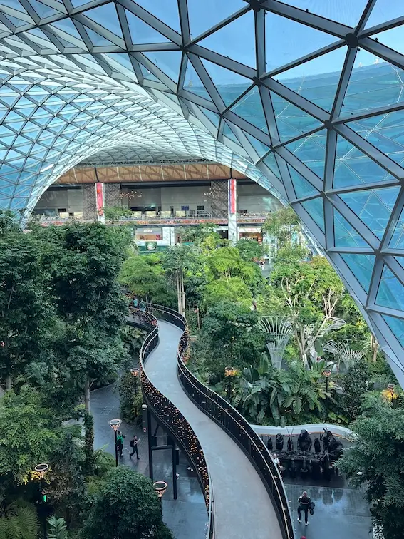
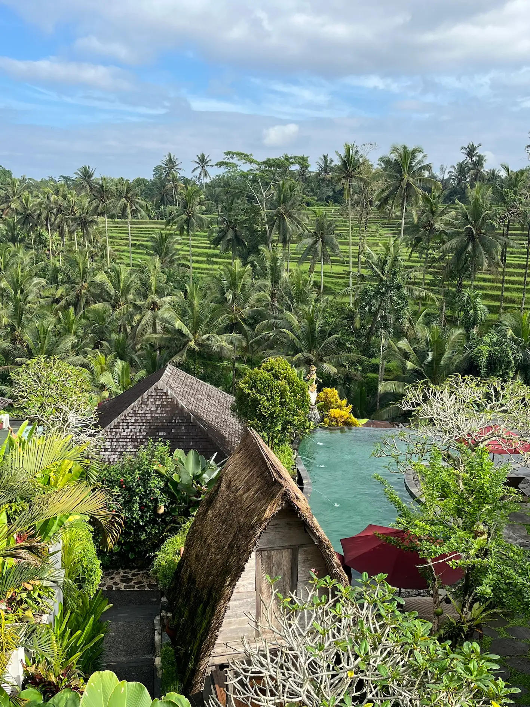

Cap sur l'Indonésie pour un séjour de 2 semaines entre l'Île des Dieux et l'Île de Feu. Au programme : ascensions de volcans, visites de temples majestueux, découverte de la culture hindoue, balades et détente au milieu des rizières,…sans oublier le mie goreng et le dardar gulung !

## Jour 1: Départ

- Compagnie Qatar Airways
- Bruxelles (9h) – Doha (16h45) Durée: 6h45
- Doha (17h30) – Denpasar (8h25) Durée: 9h55

## Jour 2: Arrivée à Bali & Ubud

- Arrivée à 8h25 matin
- Immigration, valises, douane
- Chauffeur nous conduit à l'hotel (1h30)
- Briefing par Bali Passion
- On profite de l'Afternoon Tea de l'hotel
- Dépose des valises / Repos

## Jour 3: Ubud & Taman Ayun

- Visite des rizières autour de l'hotel
- Bukit Campuhan
- Foret des singes
- Taman Ayun
- Kopi Luwak
- Danse du Legong au Ubud Palace

## Jour 4: Le Mont Batur

- Lever matinal pour ascension du mont Batur
- Descente du mont Batur à vélo
- Accident et direction l'hôpital
- Retour à l'hotel

## Jour 5: En route vers Munduk

- Les rizières de Jatiluwih
- Le marche de Bedugul
- Le lac de Dana Bratan
- Les cascades de Banyumala
- Arrivée à l'hotel Sanak Retreat
- Séance de massage pour les filles

## Jour 6: Munduk

- Piscine de l'hotel
- Visite guidée de la fôret primaire
- Pirogue sur le lac Tambligan
- Sources d'eau chaude de Banjar
- Arrivée à l'hotel Taman Sari à Pemuteran

## Jour 7: Pemuteran

- Snorkelling à Menjagan
- Visite du temple de Puri Melanting
- Warung De'Lekong

## Jour 8: Le Kawah Ijen

- Lever matinal pour aller à Java
- Ferry
- Petit déjeuner au pied du Kawah Ijen
- Ascension du Kawah Ijen
- Descente et achat de fruits au marché
- Voiture jusqu'au pied du Bromo
- Hotel Joglo Kecombrang Bromo

## Jour 9: Le Mont Bromo

- Lever matinal pour assister au lever du soleil sur le mont Bromo
- Beaucoup de Jeeps
- Superbe lever du soleil sur les différents monts: Mont Batok et Mont Seremu
- Redescente en jeep jusqu'au pied du Bromo
- On découvre la plaine qu'on a emprunté de nuit
- Ascension pour aller au cratère qui est accessible à l'aide d'escalier
- On prend la route vers la gare de Surabaya mais le chauffeur et le guide préfère nous déposer à Mojokerto
- On demande pour se rendre avant aux chutes de Madakaripura
- Comme on s'y attendait nous sommes bien à l'avance mais on décide d'aller prendre un café en face de la gare
- Un employé de la gare vient nous indiquer où attendre le train et restera avec nous à discuter et prendre des photos jusqu'à notre départ vers Yogjakarta
- Notre nouveau guide Johannes (Jean) nous attend à la sortie du quai et nous conduit à l'hotel Phoenix

## Jour 10: Borobodur, Candirejo & Candi Pawon

- Petit-déjeuner matinal
- Visite du site de Borobodur
- Visite du village traditionnel de Candirejo en calèche
- Visite du temple Pawon
- Retour à l'hotel Phoenix
- Piscine
- Visite de la rue Malioboro

## Jour 11: Merapi, Palais du Sultan, Taman Sari & Prambanan

- Visite en Jeep du volcan Merapi
- Histoire de l'éruption et de la destruction du village
- Visite du Palais du Sultan avec un guide francophone très sympathique
- Visite du musée des marionnettes
- Visite du Taman Sari
- Achat de délicieux Bakpia dans une ruelle près du Taman Sari
- Visite de Prambanan
- Retour à l'hotel Phoenix

## Jour 12: Nusa Penida

- Réveil matin pour se rendre à l'aéroport de Yogja
- Vol domestique vers Denpasar avec la compagnie Lion Air
- Transfert à Sanur pour prendre le Speed Boat vers Nusa Penida
- Chauffeur nous conduit à la Villa Panorama
- On profite de la piscine privée

## Jour 13: Diamond Beach, Atuh Beach & Goa Guri Putri

- Petit-déjeuner préparé par des locaux: pancakes bananes entre autres
- On prend la route vers Diamond Beach
- Atuh Beach
- Visite du temple hindou souterrain Goa Guri Putri
- Diner à The Terrace

## Jour 14: Snorkelling, Crystal Bay, Angel's Billabong, Broken Beach, Kellingking Beach

- Snorkelling pour observer des raies manta
- On s'arrête à Crystal Bay et Alix propose d'aller à la plage secrète de Pandan Beach
- Direction Angel's Billabong et Broken Beach
- Ensuite la plage la plus photographiée de Nusa Penida: Kellingking Beach

## Jour 15: Retour à Bali et visite d'Uluwatu

- On profite de la piscine avant de quitter Nusa Penida
- Speedboat vers Sanur où nous sommes accueillis par notre dernier guide pour la fin du séjour
- Direction le sud de Bali à Uluwatu – nombreux singes chipeurs
- Plutôt que d'assister au spectacle Danse du feu à Uluwatu notre guide propose d'aller voir ce spectacle à Melasti
- Diner sur la plage de Jimbaran
- Arrivée au dernier hotel le Kashantee Village

## Jour 16: Tanah Lot & Seminyak

- Visite de Tanah Lot
- Massage balinais en famille
- Le voyage se termine et on prend la route de l'aéroport de Denpasar

## Jour 17: Retour en Belgique

- Décollage de Denpasar à 1h05 du matin pour arriver à Doha à 5h40
- On en profite pour utiliser quelques Avios pour se prendre un café au Harrods Tea Room
- Décollage vers Bruxelles à 8h55 pour atterrir à 14h40
